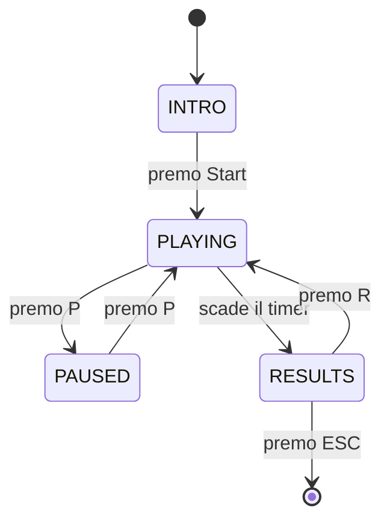

# Architettura

> Qui spiegate **come è fatto dentro** il progetto. Non ripetete il testo della specifica: scrivete cosa avete fatto voi, come lo avete organizzato, e perché.

## Decomposizione in moduli

Per ciascun modulo del vostro progetto, una-due righe:

- `main.py` — …
- `config.py` — …
- `models.py` — …
- `rules.py` — …
- `scoring.py` — …
- `generator.py` — …
- `states.py` — …
- `ui.py` — …
- `input_handler.py` — …

Se avete aggiunto/rimosso moduli rispetto alla struttura suggerita, spiegate perché.

## Separazione logica / presentazione

Quali moduli sono "puri" (non importano pygame)? Quali sono legati al rendering? Come comunicano fra loro?

Se avete fatto scelte non ovvie (es. passare lo stato come parametro invece che come variabile globale), spiegate il ragionamento.

## Macchina a stati

Diagramma della macchina a stati (Mermaid va benissimo, è supportato da GitHub):

Spiegate brevemente ciascuno stato: cosa fa, cosa disegna, quali input ascolta, verso quali stati può transire.

## Flusso di un trial

Descrivete il ciclo di vita di un singolo trial, dall'istante in cui il generatore lo crea all'istante in cui viene archiviato nelle statistiche. Dove nasce? Come viene valutato? Chi aggiorna lo scoring? Chi attiva il feedback?

Un diagramma di sequenza Mermaid aiuta molto qui.

## Dati principali

Le vostre `dataclass` principali (`Trial`, `ScoringState`, `SessionStats`): cosa contengono, chi le crea, chi le modifica.

## Scoring: come è implementato

Due righe di riassunto del sistema (meter, moltiplicatore, bonus) e riferimento al file dove sta il codice. Non ripetete la formula della specifica — spiegate come l'avete tradotta in codice voi.

## Generatore: bilanciamento e seed

- Come evitate streak lunghe?
- Come bilanciate YES/NO?
- Come funziona il seed? Come lo testate?

## Fading istruzioni

Come è implementato tecnicamente? Dove vive la variabile «quante risposte corrette finora»? Chi la aggiorna? Come si trasforma in opacità?

---

### Domande-guida

1. Se un compagno apre il progetto per la prima volta, capisce dove cercare cosa?
2. Avete spiegato **perché** le vostre scelte, o solo **cosa** avete fatto?
3. I diagrammi Mermaid si aprono correttamente su GitHub? (Verificate nel browser.)
4. Qualcuno che legge solo questa pagina riesce a farsi un'idea corretta dell'architettura?
