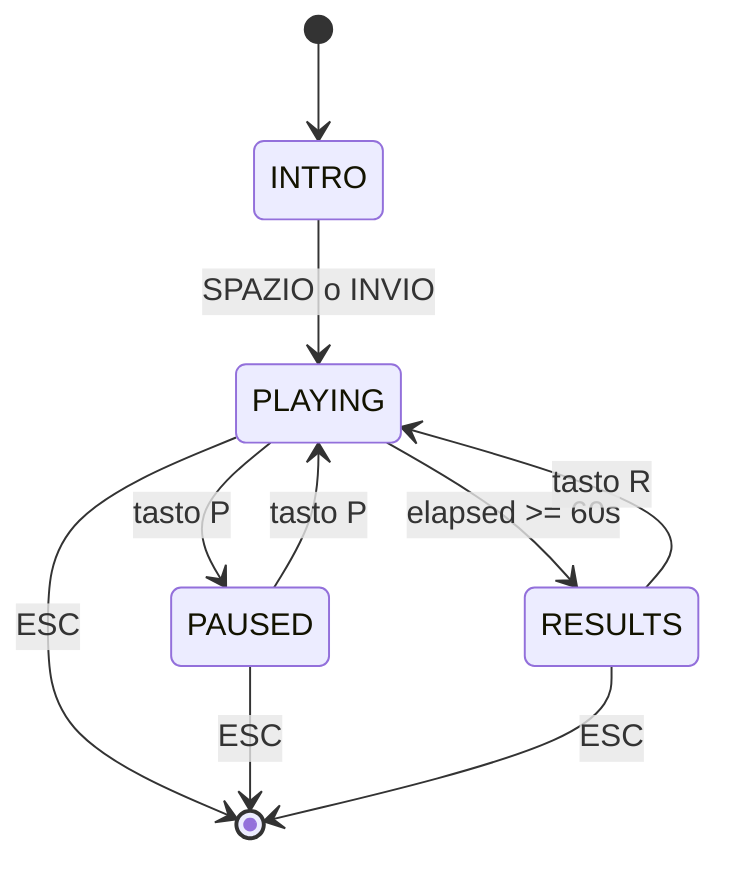

# Architettura

## Decomposizione in moduli

- `main.py` — Entry point e cuore del progetto: contiene il `GameLoop`, la dataclass `GameState`, le funzioni di transizione di stato (`start_playing`, `submit_answer`, `end_game`, `reset_and_replay`) e il rendering condizionale per stato.
- `config.py` — Costanti pure (dimensioni schermo, colori, timing, soglie di fade). Non importa nulla; è importato da tutti gli altri moduli tranne `models.py`.
- `models.py` — Definisce la dataclass `Trial` (posizione, lettera, numero, risposta attesa, risposta utente, correttezza, tempo di risposta). Zero dipendenze esterne.
- `rules.py` — Funzioni pure `is_even`, `is_vowel`, `compute_expected_answer`. Non sa nulla di pygame né di stato di gioco.
- `scoring.py` — Funzioni pure `apply_answer_advanced` e `apply_final_bonus`. Ricevono valori scalari e ne restituiscono di nuovi, senza side effect.
- `generator.py` — Funzione `generate_trial(rng, position_history)` con logica anti-streak. Dipende da `models` e `rules`, non da pygame.
- `ui.py` — Tutte le funzioni di rendering pygame (`draw_card`, `draw_hud`, `draw_trial_prompt`, `draw_results`, ecc.). Riceve i dati come parametri, non ha stato proprio.

---

## Separazione logica / presentazione

**Moduli puri (zero import di pygame):** `config.py`, `models.py`, `rules.py`, `scoring.py`, `generator.py`. Questi sono completamente testabili senza display grafico, e infatti la suite di test li colpisce direttamente.

**Moduli legati al rendering:** `ui.py` importa `pygame` e `models.Trial`. Tutte le sue funzioni sono *stateless*: ricevono ciò che devono disegnare come argomenti e non conservano nulla tra un frame e l'altro.

**Bridge:** `main.py` importa entrambi i mondi. Chiama le funzioni di `ui.*` passando esplicitamente i campi di `GameState` — mai il `GameState` intero — in modo che `ui.py` non dipenda da `main.py` (dipendenza unidirezionale).

La scelta di passare lo stato come parametro (invece di una variabile globale) permette di istanziare, testare e resettare `GameState` senza toccare il modulo grafico.

---

## Macchina a stati



| Stato | Cosa fa | Cosa disegna | Input ascoltati | Transizioni possibili |
|---|---|---|---|---|
| **INTRO** | Attende che il giocatore sia pronto | Titolo + regole + controlli | SPAZIO, INVIO, ESC | → PLAYING, → exit |
| **PLAYING** | Esegue i trial, aggiorna timer e scoring | HUD, carta, istruzioni fade, bottoni SI/NO, feedback | Frecce, click, P, ESC | → PAUSED, → RESULTS, → exit |
| **PAUSED** | Congela il timer (`pause_start`) | HUD congelato, carta, overlay semitrasparente + "PAUSA" | P, ESC | → PLAYING, → exit |
| **RESULTS** | Mostra statistiche finali | Punteggio, accuratezza, streak, bonus, tempi medi | R, ESC | → PLAYING (nuovo game), → exit |

---

## Flusso di un trial

```mermaid
sequenceDiagram
    participant Main
    participant Generator
    participant Rules
    participant Scoring
    participant UI

    Main->>Generator: generate_trial(rng, position_history)
    Generator->>Rules: compute_expected_answer(position, letter, number)
    Rules-->>Generator: expected_answer: bool
    Generator-->>Main: Trial(position, letter, number, expected_answer)
    Main->>UI: draw_card(screen, trial, config, card_color)
    Main->>UI: draw_trial_prompt(screen, trial, config, opacity)

    Note over Main: Utente preme freccia o clicca

    Main->>Main: submit_answer(gs, user_answer)
    Main->>Scoring: apply_answer_advanced(score, multiplier, meter, is_correct)
    Scoring-->>Main: (score, multiplier, meter) aggiornati
    Main->>Main: aggiorna correct_count, wrong_streak, streaks, response_times
    Main->>Main: feedback_until = now + FEEDBACK_DURATION
    Main->>Generator: generate_trial(rng, position_history) → gs.next_trial

    Note over Main: Frame successivi: mostra feedback colorato

    Main->>UI: draw_feedback_icon(screen, is_correct, config)

    Note over Main: Dopo inter_trial_until

    Main->>Main: gs.trial = gs.next_trial; gs.next_trial = None
```

**Dove nasce:** `generate_trial` viene chiamato due volte: una all'avvio (per avere subito un trial pronto) e una dentro `submit_answer` per precaricare il trial successivo *durante* la fase di feedback, così non c'è latenza percepita tra un trial e l'altro.

**Chi valuta:** `submit_answer` in `main.py` confronta `trial.expected_answer` con `user_answer`. La verità ("la risposta giusta") era già calcolata da `rules.compute_expected_answer` al momento della generazione.

**Chi aggiorna lo scoring:** ancora `submit_answer`, che chiama `scoring.apply_answer_advanced` e scrive i risultati direttamente nei campi scalari di `GameState`.

**Chi attiva il feedback:** `submit_answer` setta `gs.feedback_until` e `gs.feedback_is_correct`; il game loop li legge ogni frame per decidere il colore della carta e se disegnare l'icona ✓/✗.

---

## Dati principali

### `Trial` (in `models.py`)
Creata da `generator.generate_trial`. Modificata da `submit_answer` (aggiunge `user_answer`, `is_correct`, `response_time`). Non ha metodi: è un contenitore puro.

```
Trial
├── position: str          # "TOP" o "BOTTOM"
├── letter: str            # A-Z maiuscolo
├── number: int            # 1-9
├── expected_answer: bool  # calcolata da rules al momento della generazione
├── user_answer: bool|None # None finché non risponde
├── is_correct: bool       # False di default, aggiornata in submit_answer
└── response_time: float|None  # secondi dalla comparsa del trial alla risposta
```

### `GameState` (in `main.py`)
Unico oggetto mutable di tutta la partita. Creato da `create_new_game()`, resettato da `reset_and_replay()`. Raggruppa scoring, timer, trial corrente/prossimo, statistiche di sessione e lo `state` della macchina a stati. Non esiste una `ScoringState` separata: i tre scalari `score`, `multiplier`, `meter` sono campi diretti di `GameState` e vengono passati alle funzioni di `scoring.py` che restituiscono i nuovi valori (pattern funzionale, senza mutation dentro `scoring`).

---

## Scoring: come è implementato

Il sistema è in `scoring.py` e si basa su tre scalari (`score`, `multiplier`, `meter`) che vivono in `GameState`.

**Risposta corretta:** `score += 50 × multiplier`; `meter += 1`. Quando `meter` raggiunge 4, il `multiplier` sale di 1 (max 10) e il meter si azzera — la funzione implementa questo con un semplice `if meter == 4`.

**Risposta sbagliata:** se `meter > 0` si azzera solo il meter (il moltiplicatore è "protetto"); se `meter == 0` il moltiplicatore scende di 1 (min 1). Questa logica a due livelli è stata tradotta direttamente con un `if/else` sul valore di `meter` prima della modifica.

**Bonus finale:** `apply_final_bonus` aggiunge `250 × multiplier_finale` e viene chiamato una sola volta in `end_game`.

---

## Generatore: bilanciamento e seed

**Anti-streak di posizione:** `generate_trial` riceve `position_history` (lista di tutte le posizioni precedenti). Guarda gli ultimi `MAX_POSITION_STREAK = 3` elementi: se sono tutti uguali, forza l'altra posizione. Altrimenti sceglie casualmente.

**Bilanciamento YES/NO:** Le lettere sono scelte con probabilità 50% vocale / 50% consonante, il che bilancia le risposte YES/NO per i trial in posizione BOTTOM (vocale → YES). I numeri 1-9 non sono eguali perchè il numero di numeri pai è 4 mentre quelli dispari è 5.

**Seed:** In produzione `rng = random.Random()` senza seed fisso (sequenza diversa ogni partita). Nei test si usa `random.Random(seed)` con seed noto per rendere le sequenze deterministiche e verificabili. I test in `test_generator.py` controllano proprietà statistiche su campioni grandi (es. frequenza vocali, distribuzione posizioni) che reggono indipendentemente dal seed specifico.

---

## Fading istruzioni

**Dove vive il contatore:** `gs.correct_count` (int) in `GameState`. Viene incrementato di 1 in `submit_answer` a ogni risposta corretta. Non viene mai decrementato (è cumulativo, non la streak corrente).

**Chi lo aggiorna:** esclusivamente `submit_answer` in `main.py`.

**Come si trasforma in opacità:** la funzione pura `get_instruction_opacity(correct_count, wrong_streak)` in `main.py` applica le soglie definite in `config.py`:

| `correct_count` | opacità base |
|---|---|
| 0 – 3 | 255 (100%) |
| 4 – 7 | 178 (70%) |
| 8 – 11 | 102 (40%) |
| 12+ | 0 (invisibile) |

Se `wrong_streak >= 3` (errori consecutivi), la funzione aggiunge fino a 160 punti di opacità extra (`wrong_streak × 40`, capped a 160) per far ricomparire le istruzioni al giocatore in difficoltà.

**Come viene applicata:** `draw_trial_prompt` in `ui.py` riceve `opacity: int`. Se `opacity <= 0` ritorna subito. Altrimenti disegna testo e freccia su una `Surface` temporanea con `pygame.SRCALPHA`, poi la blit sul frame corrente — questo permette la trasparenza parziale senza alterare il colore della carta sottostante.